# Mock Server

[中文文档](./docs/zh/README.md)

A widget for mocking back-end api when development, it will generate a mock api configuration by local file, and start a node server. Then just forward the front-end request to that server.

## Installation

mock-server-local requires node v8.x.x or higher.

Global install

```bash
npm install -g mock-server-local
```

Local install within project

```bash
npm install mock-server-local --save-dev
```

## Usage

```bash
Usage: mock [options]

Mock your apis with a node server

Options:
  -v, --version      output the version number

  -p, --port [port]  port server should listen on, defalut 8888, +1 when port is used

  -d, --dir [dir]    dir path of mock data, default "."

  -h, --help         output usage information
```

**Attention**: When the port is specified (`-p/--port`), if the specified port is already occupied, it will return error and fail to start server. It will perform port availability checks and dynamically determine ports only when start with the default port.

### Start server

```bash
mock -p 8888 -d ./mock # ./mock is the dir wherr you place the mock api data

you can access mock server:
http://127.0.0.1:8888
http://192.168.0.1:8888 # local ip

you can access mock server view:
http://127.0.0.1:8888/view
http://192.168.0.1:8888/view # local ip
```

And then visit `http://127.0.0.1:${port}/view` in browser.

## Project Settings

After starting the mock server, we need to proxy the project's request to our mock server.

Suppose our mock server is `http://127.0.0.1:8888`, and the mock api is `api.mock.com/api-bin/*`.

### react(create-react-app)

See [create-react-app#docs](https://facebook.github.io/create-react-app/docs/proxying-api-requests-in-development#configuring-the-proxy-manually) for details

```js
// src/setupProxy.js
const proxy = require('http-proxy-middleware');

module.exports = function(app) {
  const options = {
    target: 'http://127.0.0.1:8888', // mock server
    headers: {
      host: 'api.mock.com' // here to fill in the host of the specific mock api
    }
  };
  app.use(proxy('/api-bin', options));
};
```

### vue-cli 3.x

```js
// vue.config.js
// ...
devServer: {
  proxy: {
    '/api-bin': {
      target: 'http://127.0.0.1:8888',
      headers: {
        host: 'api.mock.com' // not work
      },
      onProxyReq: function(proxyReq, req, res) {
        proxyReq.setheader('host', 'api.mock.com');
      }
    }
  }
}
// ...
```

### vue webpack template (vue-cli 2.x)

```js
// config/index.js
//...
proxyTable: {
  '/api': {
    target: 'http://127.0.0.1:8888',
    headers: {
      host: 'api.mock.com'
    }
  }
}
//...
```

### webpack

The proxy function of [webpack.devServer](https://webpack.js.org/configuration/dev-server/) is [http-proxy-middleware](https://github.com/chimurai/http-proxy-middleware).

Its configuration are no different from the above three, because the above three are also using [webpack.devServer](https://webpack.js.org/configuration/dev-server/).

### Proxy Tools

If your project does not base on webpack's functionality (or other module bundler tools), and not using [http-proxy-middleware](https://github.com/chimurai/http-proxy-middleware) too.

Also can forward request using a proxy tool, such as [whistle](https://github.com/avwo/whistle).

```bash
api.mock.com/api-bin 127.0.0.1:8888 # api.mock.com/api-bin/* requests will be forwarded to the mock server
api.mock.com 127.0.0.1:8080 # Local server for server front-end resource during development
# api.mock.com /path/to/your/fe/project/index.html # Or use local files
```

## Mock api

If you want the mock api with full url to be `api.mock.com/api-bin/api1`, the directory structure should as follows (the full configuration can be found in [docs/mock](./docs/mock))

```
${mock dir}
  |- api.mock.com
    |- api-bin
      |- api1
        |- option1
          |- data.js
        |- option2
          |- data.js
```

## Status switching

An mocked api can store multiple state data returns. You can select the check box with the status want to be responded. (`http://127.0.0.1:${port}/view/mocks`).

```js
// ${mock dir}/api.mock.com/api1/option1/data.js
module.exports = {
  code: '0',
  msg: 'return option 1'
};

// ${mock dir}/api.mock.com/api1/option2/data.js
module.exports = {
  code: '0',
  msg: 'return option 2'
};
```

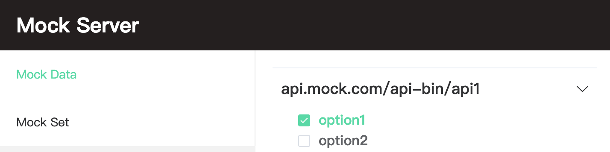

Then request to `api.mock.com/api-bin/api1` through proxy.

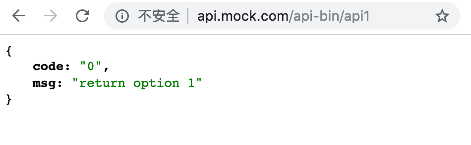

## More configuration

### Respond html

```js
// ${mock dir}/path/represent/your/api/return html/data.js
module.exports = `
<!DOCTYPE html>
<html lang="en">
<head>
  <title>Document</title>
</head>
<body>return html</body>
</html>
`;
```

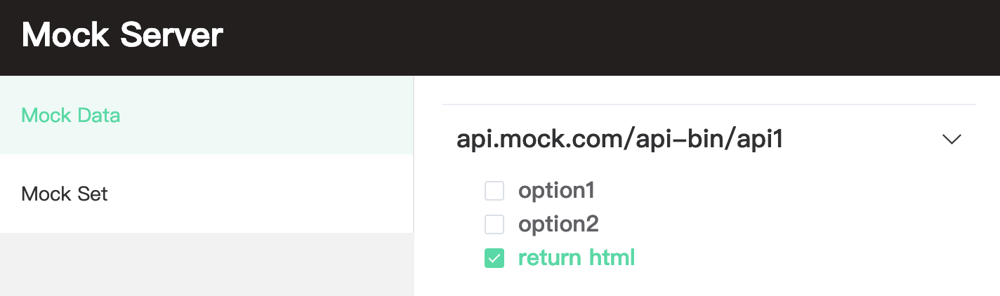
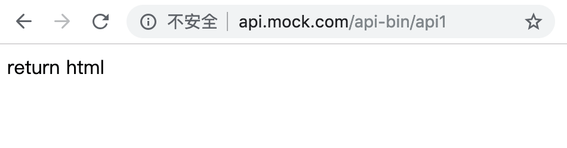

### Time-consuming api

If you want to simulate an api that takes long time, you can specify it with `http.js`.

```js
// ${mock dir}/path/represent/your/api/time cose 2s/data.js
module.exports = {
  code: '0',
  msg: 'response after 2s'
};

// ${mock dir}/path/represent/your/api/time cose 2s/http.js
module.exports = {
  delay: 2, // If there is no http.js file or no delay is specified, the default is 0.2.
}
```

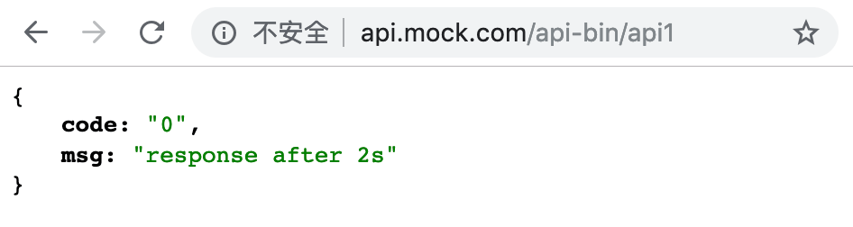
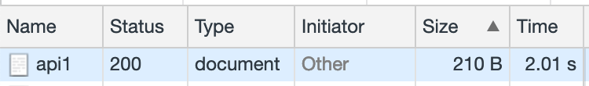

### Http status code

If you need to simulate the status code of api other than 200, you can also specify it in `http.js`.

```js
// ${mock dir}/path/represent/your/api/http statuc code 404/data.js
module.exports = 'Not Found';

// ${mock dir}/path/represent/your/api/http statuc code 404/http.js
module.exports = {
  status: 404
}
```

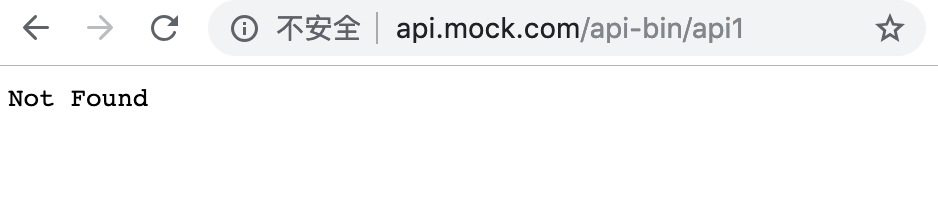
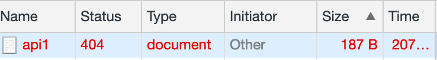

### http.js

The configuration and default values ​​supported by `http.js` are as follows.

```js
// http.js
module.exports = {
  header: {
    Connection: 'Close',
    'Content-Type': 'application/json; charset=UTF-8',
    'Access-Control-Allow-Origin': '*'
  }, // http header
  status: 200, // http request status code, default is 200
  delay: 0.2 // time cost of api, default is 0.2s
}
```

### Javascript functionality

`data.js` can export a function, which will be passed a [ctx] param (https://koajs.com/#context) and need to return an object that contains data.

```
function(ctx:koa context):Object {data,[header,status,delay]}
```

```js
// ${mock dir}/path/represent/your/api/mock with function/data.js
module.exports = function(ctx) {
  const { request: req } = ctx;
  let { id } = req.query;

  return {
    data: {
      code: '0',
      msg: `you request with id: ${id}`
    }
  };
}
```

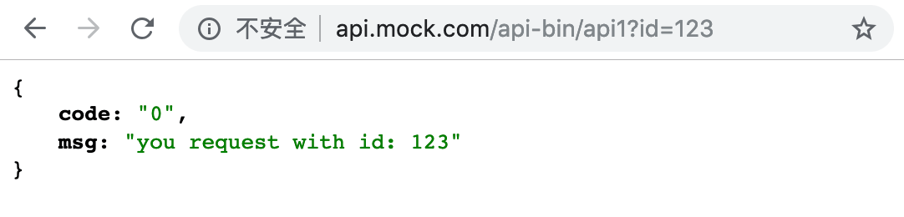

You can simulate the behavior of the online api as much as possible in function, including the validate the http request(http method, params, etc.), and respond different outputs depending on the input.

**Attention**: If you want external npm module in `data.js`, be sure not to install the module into `${mock dir}`'s root directory, please install it to the parent directory of `${mock dir}`.


```bash
# cwd: ./
npm install
```

```js
// cwd: ./mock/path/represent/your/api/mock with function/data.js
const xxx = require('xxx'); // npm模块
module.exports = {};
```

## Forward to online api

Sometimes with project iterations, some of the apis on the online/test server are available.

You may only need to mock some new apis. When the request do not match your mock configuration, it will be forwarded to target server.

```js
// ${mock dir}/_proxy.js
module.exports = {
  'api.mock.com': 'https://192.168.0.xxx' // the server ip that the request will be forwarded to. Note that the protocol https/http cannot be omitted.
};
```

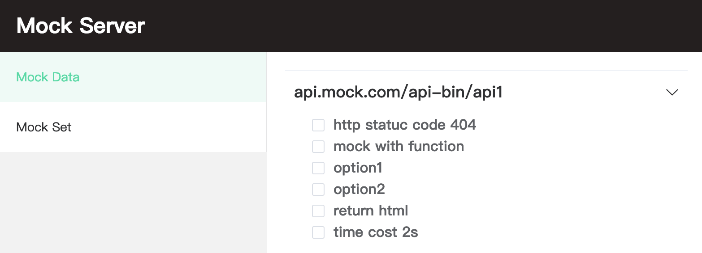

The request to `api.mock.com/api-bin/api1` or `api.mock.com/api-bin/api2`, will eventually request a server with ip `192.168.0.xxx`.

## Set switching

Different business logic/exceptional processes may involve more than one api.

When you want to simulate a complete online operation process, it may be troublesome to select the checkbox of many apis.

So you can new a `_set` directory in `${mock dir}`, `_set` is used to place multiple set of apis.

```
${mock dir}
  |- _set
    |- api flow 1
      |- api.mock.com
        |- api-bin
          |- api1
            |- data.js
          |- api2
            |- data.js
```

```js
// ${mock dir}/_set/path/represent/your/api/api1/data.js
module.exports = {
  code: '0',
  msg: 'match api flow, return from api1'
}

// ${mock dir}/_set/path/represent/your/api/api2/data.js
module.exports = {
  code: '0',
  msg: 'match api flow, return from api2'
}

// In addition, you can directly use the data in the mock api configuration.
// ${mock dir}/_set/path/represent/your/api/api2/data.js
const data = require('${mock dir}/path/represent/your/api/option1/data.js');
module.exports = data;
```

Then go to the page (`http://127.0.0.1:${port}/view/sets`) to select the a set which should be responded.

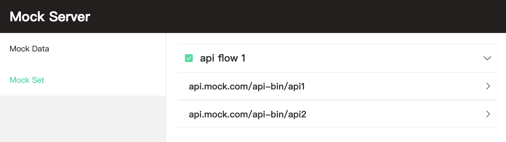
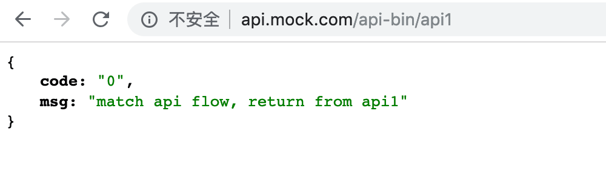
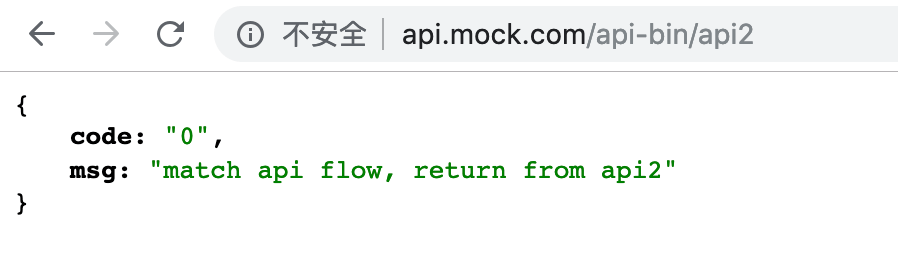

the request will preferentially match the api in the mock set.

Respond if it matches, or it will try to match again in mock api(in `http://127.0.0.1:${port}/view/mocks`) when fail in set match.

If fails again, it will check `_proxy.js` and forward it to the target server.

If the proxy ip is not configured, it will return 404 directly.

## Recommend

Recommend to install mock-server-local as a devDependency within project.

```bash
cd xxx_project

npm install mock-server-local --save-dev
```

Create a mock directory in the project directory to place the mock api configuration.

```
|- xxx_project
  |- mock
  |- package.json
```

Then use npm script to start the mock server

```js
// package.json
{
  //...
  "scripts": {
    "mock": "mock -p 8888 -d ./mock"
  },
  //...
}
```

```bash
npm run mock
```

Place the mock api in project, it will be easy to maintain mock api by members via CVS.

And the newcomer can also better understand the logic/abnormal process through the mock api.

## Development

```bash
git clone https://github.com/funkyLover/mock-server.git

cd mock-server && npm install

cd fe && npm install

npm run dev # cwd: /path/to/mock-server
```
