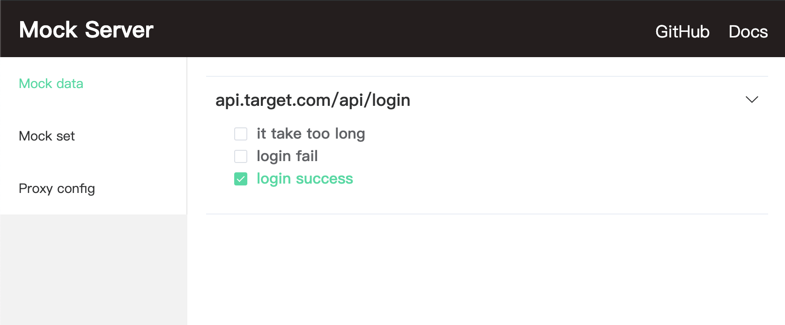
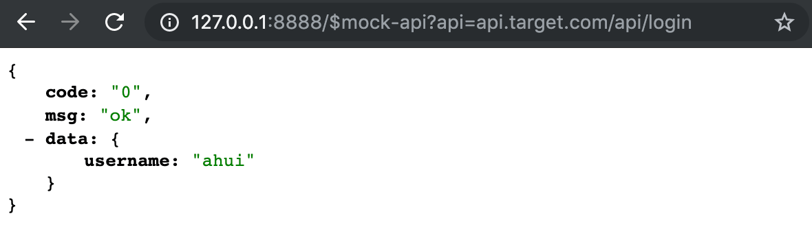

<p align="center">
  
</p>

[中文文档](./docs/zh/README.md)

[](https://travis-ci.com/funkyLover/mock-server)
[](https://www.npmjs.com/package/mock-server-local)

[](https://github.com/prettier/prettier)

A widget for mocking back-end api when development, it will generate mock data by local file configuration, and start a node server. Then just forward the client-side request to that server.

## Installation

mock-server-local requires node v8.x.x or higher.

Global install

```bash
npm install -g mock-server-local
```

Local install within project

```bash
npm install mock-server-local --save-dev
```

## Usage

```bash
Usage: mock [options]

Mock your apis with a node server

Options:
  -v, --version      output the version number

  -p, --port [port]  port server should listen on, defalut 8888, +1 when port is used

  -d, --dir [dir]    dir path of mock data, default "."

  -h, --help         output usage information
```

**Attention**: When the port is specified (`-p/--port`), if the specified port is already occupied, it will return error and fail to start server. It will perform port availability checks and dynamically determine ports only when start with the default port.

### Start mock server

Setup a new folder to store the mock data configuration. Suppose the api that need to be mock is `api.target.com/api/login`, and the should simulate three behaviors.

- `api.target.com/api/login`
  1. Login succeeds, return user information and login status
  1. Login failed, return the cause of the error
  1. It takes too long, causing the frontend request to time out

Then the mock file configuration directory structure should look like this:

```bash
|- mock
  |- api.target.com
    |- api
      |- login
        |- login success
          |- data.js # define res data
        |- login fail
          |- data.js
        |- it takes too long
          |- data.js
          |- http.js # define res http header, status code, time cost
```

```bash
mock -p 8888 -d ./mock # ./mock is the dir wherr you place the mock api data

you can access mock server:
http://127.0.0.1:8888
http://192.168.0.1:8888 # local ip

you can access mock server view:
http://127.0.0.1:8888/view
http://192.168.0.1:8888/view # local ip
```

And then visit `http://127.0.0.1:8888/view/mocks` in browser. Check the data you want to respond to api.

```js
//mock/api.target.com/api/login/login success/data.js
module.exports = {
  code: '0',
  msg: 'ok',
  data: {
    username: 'ahui'
  }
};
```

<p align="center">
  
</p>

You can directly request `http://127.0.0.1:8888/$mock-api?api=api.target.com/api/login` to verify that the mock data is properly configured.

<p align="center">
  
</p>

## Project Settings

After starting the mock server, we need to proxy the project's request to our mock server.

Suppose our mock server is `http://127.0.0.1:8888`, and the mock api is `api.target.com/api/*`.

### react(create-react-app)

See [create-react-app#docs](https://facebook.github.io/create-react-app/docs/proxying-api-requests-in-development#configuring-the-proxy-manually) for details

```js
// src/setupProxy.js
const proxy = require('http-proxy-middleware');

module.exports = function(app) {
  const options = {
    target: 'http://127.0.0.1:8888', // mock server
    headers: {
      host: 'api.target.com' // here to fill in the host of the specific mock api
    }
  };
  app.use(proxy('/api', options));
};
```

### vue-cli 3.x

```js
// vue.config.js
// ...
devServer: {
  proxy: {
    '/api': {
      target: 'http://127.0.0.1:8888',
      headers: {
        host: 'api.target.com' // not work
      },
      onProxyReq: function(proxyReq, req, res) {
        proxyReq.setHeader('host', 'api.target.com');
      }
    }
  }
}
// ...
```

### vue webpack template (vue-cli 2.x)

```js
// config/index.js
//...
proxyTable: {
  '/api': {
    target: 'http://127.0.0.1:8888',
    headers: {
      host: 'api.target.com'
    }
  }
}
//...
```

### webpack

The proxy function of [webpack.devServer](https://webpack.js.org/configuration/dev-server/) is [http-proxy-middleware](https://github.com/chimurai/http-proxy-middleware).

Its configuration are no different from the above three, because the above three are also using [webpack.devServer](https://webpack.js.org/configuration/dev-server/).

### Proxy Tools

If your project does not depend on webpack (or other module bundler tools), and not using [http-proxy-middleware](https://github.com/chimurai/http-proxy-middleware) too.

Also can forward request using a proxy tool, such as [whistle](https://github.com/avwo/whistle).

```bash
api.target.com/api 127.0.0.1:8888 # api.target.com/api/* requests will be forwarded to the mock server
api.target.com 127.0.0.1:8080 # Local server for server front-end resource during development
```

## More documentation

- [Switch mock data](./docs/en/switch.md)
- [Mock configuration](./docs/en/config.md)
- [Proxy](./docs/en/proxy.md)

## Recommend

Recommend to install mock-server-local as a devDependency within project.

```bash
cd xxx_project

npm install mock-server-local --save-dev
```

Create a mock directory in the project directory to place the mock api configuration.

```bash
|- xxx_project
  |- mock
  |- package.json
```

Then use `npm script` to start the mock server

```js
// package.json
{
  //...
  "scripts": {
    "mock": "mock -p 8888 -d ./mock"
  },
  //...
}
```

```bash
npm run mock
```

Place the mock api in project, it will be easy to maintain mock api by members via CVS.

And the newcomer can also better understand the logic/abnormal process through the mock api.

## Development

```bash
git clone https://github.com/funkyLover/mock-server.git

cd mock-server && npm install

cd fe && npm install

npm run dev # cwd: /path/to/mock-server
```

## Roadmap

- pac support
- ws support
- run as daemon process
- request record
- ...
