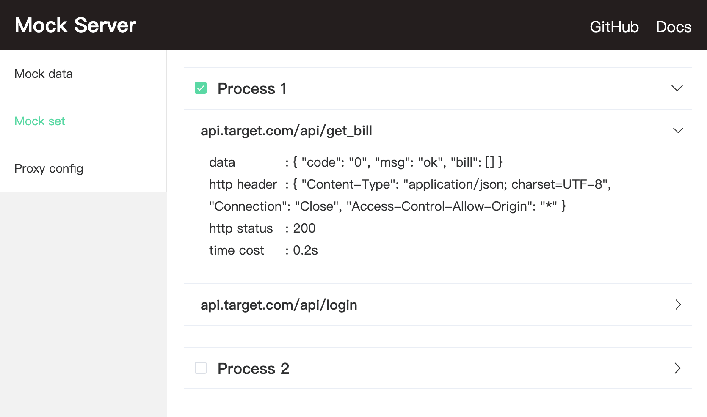
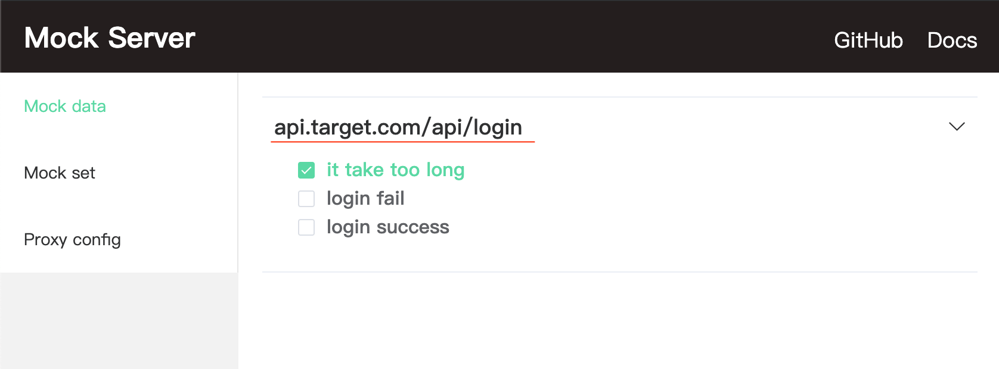
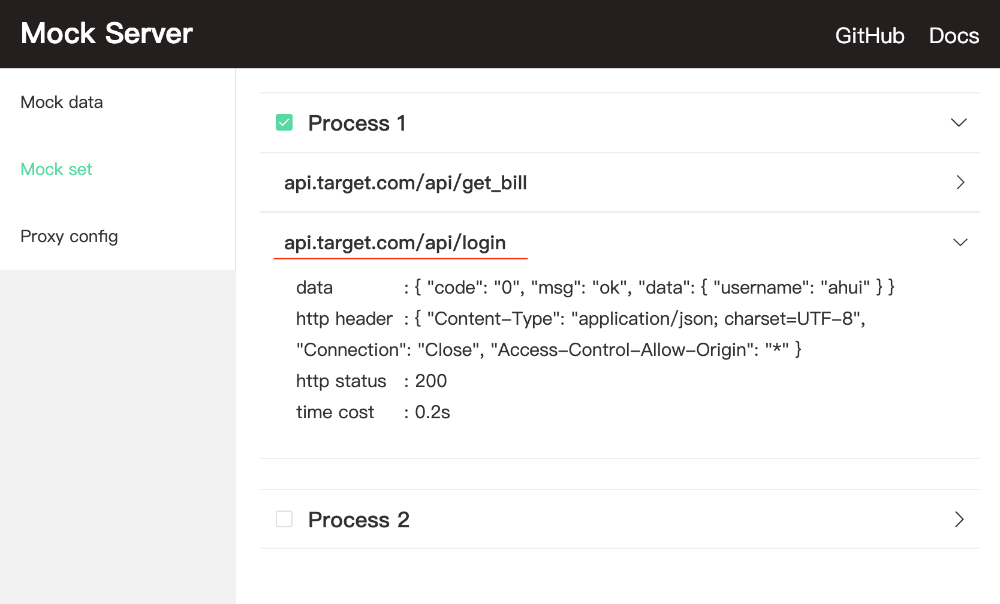

# Switch mock data

Mock data configuration can predefine multiple different response data for an api

Then you can check the data to be responded to in the mock server front-end control panel `http://127.0.0.1:8888/view/mocks`

```bash
|- mock
  |- api.target.com
    |- api
      |- login
        |- Login success
          |- data.js
        |- Login fail
          |- data.js
        |- It takes too long
          |- data.js
          |- http.js
```

<p align="center">
  
</p>

> When modifying the mock data configuration, there is no need to restart the mock server

## Batch switching

Generally different business processes may not only involve a single api, but the entire process will request multiple api.

For mocking the specific process, You may need to switch many apis' mock, which may be troublesome.

You can add the `_set` directory to the mock folder to configure mock data for multiple apis.

The mock directory configuration below can specify mock data for apis in two business processes.

```bash
# Simple example
|- mock
  |- _set
    |- Process 1
      |- api.target.com
        |- api
          |- login
            |- data.js # Login success, user's status verified alredy
          |- get_bill
            |- data.js # return billing information
    |- Process 2
      |- api.target.com
        |- api
          |- login
            |- data.js # Login successful, user's status unverified
          |- get_bill
            |- data.js # Prompt for verification
```

Then you can fast switch mock for specific process apis in `http://127.0.0.1:8888/view/sets`

<p align="center">
  
</p>

You can first define different response data for the api.

And require the mock in api for specific process.

```bash
|- mock
  |- api.target.com/api/login
    |- Login successfully, user authenticated/data.js
    |- Login succeeded, user did not verify/data.js
  |- _set
    |- Process 1/api.target.com/api/login
      |- data.js # Login successful, user'status verified
    |- Process 2/api.target.com/api/login
      |- data.js # Login successful, user'status unverified
```

```js
// mock/_set/process 1/api.target.com/api/login/data.js
module.exports = require('path/to/api.target.com/api/login/Login successfully, user authenticated/data');

// mock/_set/process 2/api.target.com/api/login/data.js
module.exports = require('path/to/api.target.com/api/login/Login succeeded, user did not verify/data');
```

## Match priority

If an interface has the response data checked in the mock panel, and also be included in a process which checked in the set panel.

<p align="center">
  
</p>

<p align="center">
  
</p>

At this time, if you request `api.target.com/api/login`, it will match the mock data checked in the set panel first.

priority: set configuration > mock configuration
