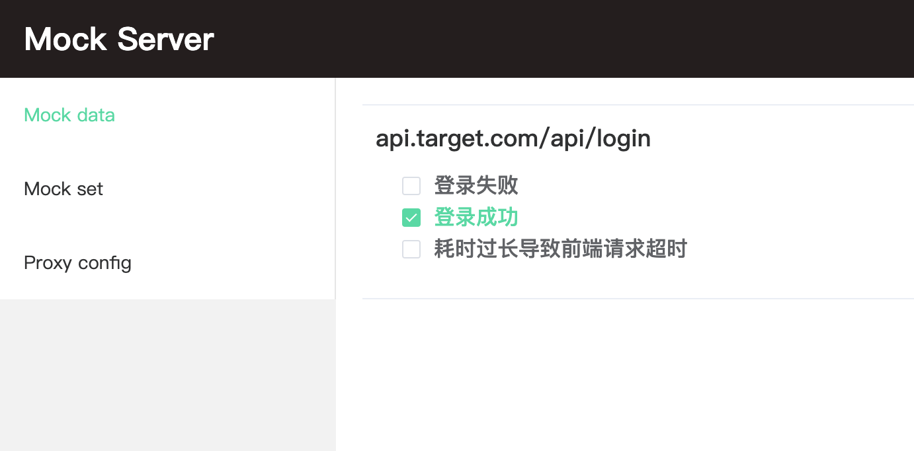
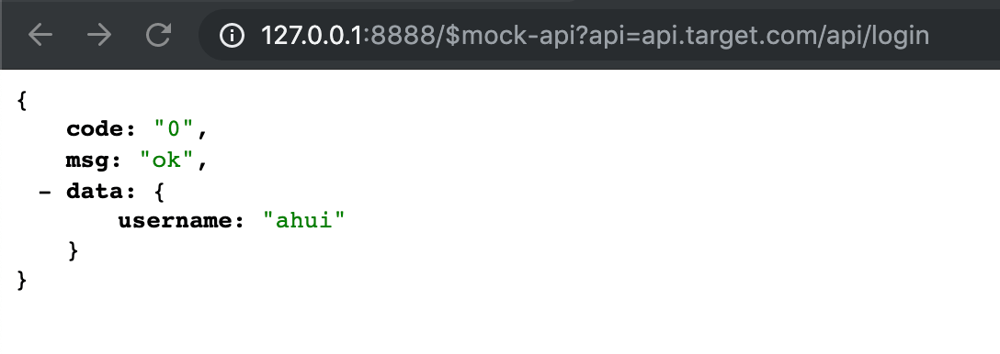

<p align="center">
  
</p>

[](https://travis-ci.com/funkyLover/mock-server)
[](https://www.npmjs.com/package/mock-server-local)

[](https://github.com/prettier/prettier)

一个用于解决前后端分离并行开发时前端依赖接口数据问题的小工具, 通过读取本地文件生成 mock api 配置并启动 node 服务器. 然后只需把前端请求转发到该服务器即可

## 安装

mock-server-local 运行环境需 node v8.x 及以上版本支持

全局安装

```bash
npm install -g mock-server-local
```

或作为项目开发依赖安装

```bash
npm install mock-server-local --save-dev
```

## 使用

```bash
Usage: mock [options]

Mock your apis with a node server

Options:
  -v, --version      output the version number

  -p, --port [port]  port server should listen on, defalut 8888, +1 when port is used

  -d, --dir [dir]    dir path of mock data, default "."

  -h, --help         output usage information
```

**注意**: 当指定端口号时(`-p/--port`), 如果指定的端口已被占用, 会直接返回启动失败, 只有使用默认端口号启动, 才会进行端口可用性检查, 并动态确定可用端口

### 启动 mock server

新建文件夹用于存放 mock 数据配置. 假设需要 mock 的接口 url 为`api.target.com/api/login`, 且该接口需要模拟三种行为.

- `api.target.com/api/login`
  1. 登录成功, 返回用户信息及登录态
  1. 登录失败, 返回错误原因
  1. 耗时过长, 导致前端请求超时

那么 mock 文件配置目录结构应该如下如下所示

```bash
|- mock
  |- api.target.com
    |- api
      |- login
        |- 登录成功
          |- data.js # data文件定义响应的数据
        |- 登录失败
          |- data.js
        |- 耗时过长导致前端超时
          |- data.js
          |- http.js # htpp文件控制响应行为, 如定义http header, 请求耗时等
```

配置好 mock 数据后启动 mock server

```bash
mock -p 8888 -d ./mock # ./mock 为存放mock数据的目录

you can access mock server:
http://127.0.0.1:8888
http://xx.xxx.x.xxx:8888 # 本机局域网ip

you can access mock server view:
http://127.0.0.1:8888/view
http://xx.xxx.x.xxx:8888/view # 本机局域网ip
```

然后访问 mock 服务前端控制面板`http://127.0.0.1:8888/view/mocks`, 勾选希望响应的数据

```js
//mock/api.target.com/api/login/登录成功/data.js
module.exports = {
  code: '0',
  msg: 'ok',
  data: {
    username: 'ahui'
  }
};
```

<p align="center">
  
</p>

可以直接请求访问`http://127.0.0.1:8888/$mock-api?api=api.target.com/api/login`验证 mock 数据是否正确配置

<p align="center">
  
</p>

## 项目设置

启动 mock 服务器后, 我们需要把业务域名的请求都转发到启动的 mock server

### react(create-react-app)

更多配置详情可翻阅官方文档[create-react-app#docs](https://facebook.github.io/create-react-app/docs/proxying-api-requests-in-development#configuring-the-proxy-manually)

```js
// src/setupProxy.js
const proxy = require('http-proxy-middleware');

module.exports = function(app) {
  const options = {
    target: 'http://127.0.0.1:8888', // mock服务器
    headers: {
      host: 'api.target.com' // 业务域名
    }
  };
  app.use(proxy('/api', options)); // api.target.com -> 127.0.0.1:8888
};
```

### vue-cli 3.x

```js
// vue.config.js
// ...
devServer: {
  proxy: {
    '/api': {
      target: 'http://127.0.0.1:8888',
      headers: {
        host: 'api.target.com'
      },
      onProxyReq: function(proxyReq, req, res) {
        proxyReq.setHeader('host', 'api.mock.com');
      }
    }
  }
}
// ...
```

### vue webpack 模板(vue-cli 2.x)

```js
// config/index.js
//...
proxyTable: {
  '/api': {
    target: 'http://127.0.0.1:8888',
    headers: {
      host: 'api.target.com'
    }
  }
}
//...
```

### webpack

[webpack.devServer](https://webpack.js.org/configuration/dev-server/)的代理功能使用的是[http-proxy-middleware](https://github.com/chimurai/http-proxy-middleware)

其配置项和上面三者没有区别, 因为上面三者使用的也是[webpack.devServer](https://webpack.js.org/configuration/dev-server/)

### 代理工具

如果你的项目不依赖 webpack(或其他类似打包工具), 也没有办法使用[http-proxy-middleware](https://github.com/chimurai/http-proxy-middleware)进行代理

那可以使用代理工具进行转发, 如[whistle](https://github.com/avwo/whistle)

```bash
api.target.com/api 127.0.0.1:8888 # api.mock.com/api/*的请求都会被转发到mock服务器
```

## 更多文档说明

- [切换响应的 mock 数据](./switch.md)
- [data & http 配置说明](./config.md)
- [请求转发](./proxy.md)

## 推荐用法

建议将 mock-server-local 作为开发依赖安装到具体项目中去

```bash
cd xxx_project

npm install mock-server-local --save-dev
```

在项目目录下新建 mock 目录用于存放 mock 数据配置

```
|- xxx_proj
  |- mock
  |- package.json
```

然后使用 `npm script` 来启动 mock 服务器

```js
// package.json
{
  //...
  "scripts": {
    "mock": "mock -p 8888 -d ./mock"
  },
  //...
}
```

```bash
npm run mock
```

以项目为维度存放 mock 数据, 项目成员共同维护

而且项目的新加入成员也可以通过 mock 数据更好的了解熟悉具体的业务逻辑/异常流程

## 开发

```bash
git clone https://github.com/funkyLover/mock-server.git

cd mock-server && npm install

cd fe && npm install

npm run dev # cwd: /path/to/mock-server
```

## Roadmap

- 支持 pac
- socket 支持
- 以后台进程运行
- 请求记录与展示
- ...
