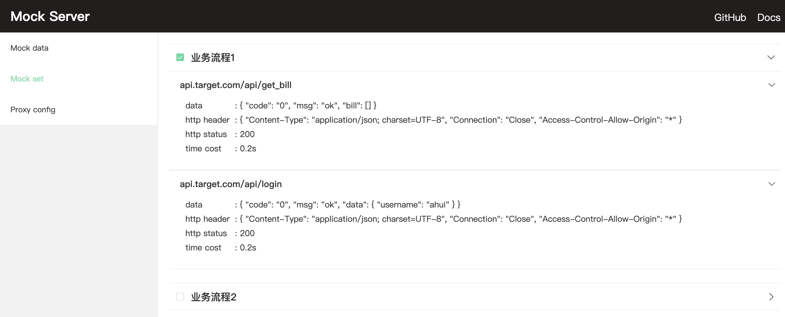
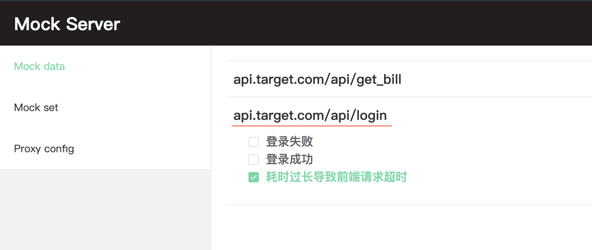
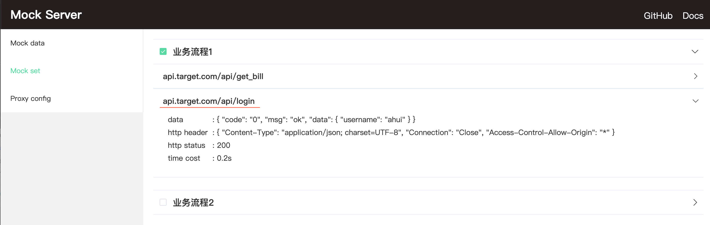

# 切换响应的 mock 数据

mock 数据配置可以为一个接口预定义多个不同的响应数据

然后可以在 mock 服务前端控制面板`http://127.0.0.1:8888/view/mocks`中勾选要响应的数据

```bash
|- mock
  |- api.target.com
    |- api
      |- login
        |- 登录成功
          |- data.js
        |- 登录失败
          |- data.js
        |- 耗时过长导致前端超时
          |- data.js
          |- http.js
```

<p align="center">
  
</p>

> 修改 mock 数据配置时, 不需要重新启动 mock server

## 批量切换

一般不同的业务流程, 可能都不仅仅只涉及单个接口, 整个流程会有请求多个接口

而流程中根据接口返回的数据不同, 又会产生多条分支, 这个时候涉及到多个接口多中数据的切换, 可能就会比较麻烦

这个时候可以在 mock 文件夹下新增`_set`目录, 用于配置多个接口的 mock 数据

如下面的mock目录配置就可以为两个业务流程中的接口指定 mock 数据

```bash
# 简单的例子
|- mock
  |- _set
    |- 业务流程1
      |- api.target.com
        |- api
          |- login
            |- data.js # 登录成功, 用户已验证状态
          |- get_bill
            |- data.js # 正常返回账单信息
    |- 业务流程2
      |- api.target.com
        |- api
          |- login
            |- data.js # 登录成功, 用户未验证状态
          |- get_bill
            |- data.js # 提示进行验证
```

然后可以在 mock 前端页面进行选择`http://127.0.0.1:8888/view/sets`

对于需要针对流程进行验证测试的场景就可以进行快速切换

<p align="center">
  
</p>

在配置 mock 数据时, 可以先对针对接口层面定义不同的响应数据

然后针对流程层面定义 mock 数据时, 再引用对应流程中需要响应的数据

```bash
|- mock
  |- api.target.com/api/login
    |- 登录成功, 用户已验证/data.js
    |- 登录成功, 用户未验证/data.js
  |- _set
    |- 业务流程1/api.target.com/api/login
      |- data.js # 登录成功, 用户已验证状态
    |- 业务流程2/api.target.com/api/login
      |- data.js # 登录成功, 用户未验证状态
```

```js
// mock/_set/业务流程1/api.target.com/api/login/data.js
module.exports = require('path/to/api.target.com/api/login/登录成功, 用户已验证/data');

// mock/_set/业务流程2/api.target.com/api/login/data.js
module.exports = require('path/to/api.target.com/api/login/登录成功, 用户未验证/data');
```

## 匹配优先级

如果某个接口, 在前端 mock 面板已经勾选了响应数据, 同样在 set 面板中勾选接口流程的也包含同一个接口

<p align="center">
  
</p>

<p align="center">
  
</p>

这个时候如果请求`api.target.com/api/login`, 会优先匹配到 set 面板中勾选的 mock 数据

当勾选的 set 配置中没有匹配到对应的接口, 才会再次尝试匹配单独定义的接口 mock 数据, 如果命中再返回 mock 面板中勾选的数据
